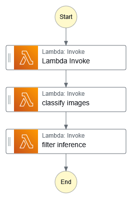
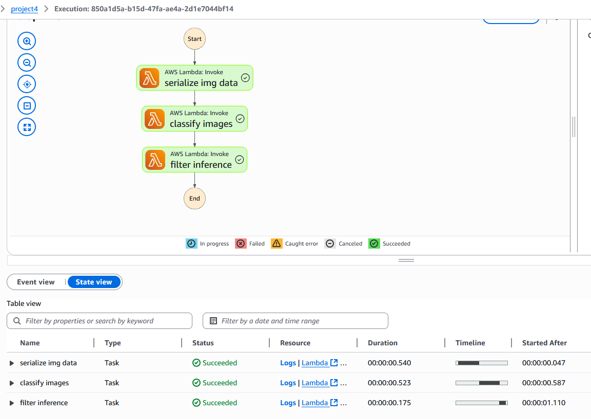
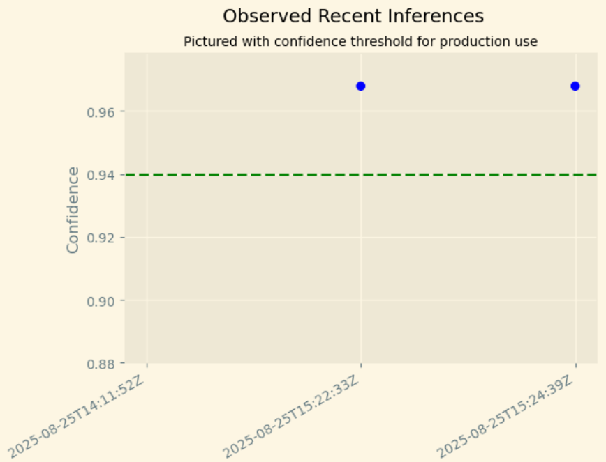
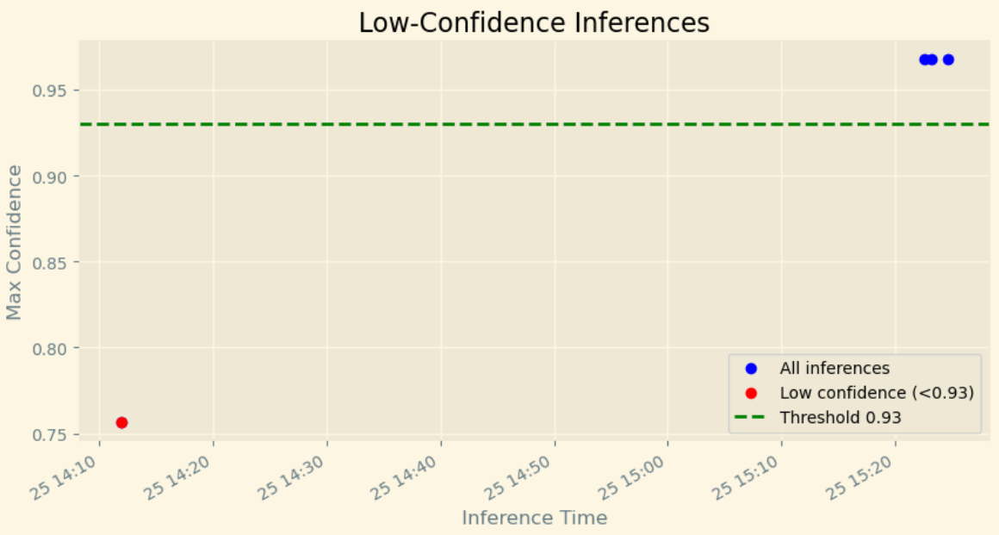

# AWS-Sagemaker-Image-Classification-Bike-vs-Motorcycle

# Scones Unlimited – Image Classification ML Workflow
## Project Overview

This project demonstrates **building, deploying, and monitoring a scalable image classification model** on AWS SageMaker. The model detects whether a delivery driver is using a bicycle or a motorcycle, helping **Scones Unlimited** optimize routing for local deliveries.

Key goals:

* Build an image classification model using AWS SageMaker.
* Deploy a **scalable and monitored endpoint** with Model Monitor.
* Automate inference workflows using **AWS Lambda** and **Step Functions**.
* Analyze captured predictions and alert on low-confidence inferences.
* Demonstrate an end-to-end  ML workflow on AWS.

---

## Project Background

Image classifiers are widely used across industries, from autonomous vehicles to eCommerce. For Scones Unlimited:

* Detecting vehicles helps assign deliveries efficiently.
* Bicycles → nearby orders; motorcycles → farther orders.
* Monitoring predictions ensures reliability and prevents degraded performance in production.

---

## Project Steps

### **Step 1: Data Staging**

* Dataset: Extracted CIFAR-100 dataset from the hosting service.
* Process: Transformed the data into a usable format for AWS SageMaker (images + label metadata).
* Loaded the data into S3 for model training.

**Key technologies:** Python, tarfile, Pandas, AWS S3, SageMaker SDK.

---

### **Step 2: Model Training & Deployment**

* Training: Used a SageMaker **built-in image classification model**.
* Deployment: Deployed to a SageMaker endpoint with **data capture enabled**:

    * Destination S3: `s3://sagemaker-us-east-1-423623866303/data_capture`
    * Capture options: Input & Output
    * Sampling: 20%

* Testing: Verified model endpoint by sending test images; predictions captured in S3 

**Key technologies:** SageMaker, DataCaptureConfig, JSONL parsing, matplotlib.

---

### **Step 3: Lambdas & Step Function Workflow**

* Built **three Lambda functions**:
- Lambda Functions:
  1. **Data generation** – prepare input data for inference.
  2. **Image classification** – call SageMaker endpoint.
  3. **Low-confidence filtering** – identify inferences below the threshold.

- Step function : chained the 3 Lambda functinos to automate inference pipeline




---

### **Step 4: Testing & Evaluation**
* Downloaded captured data from S3 using S3Downloader and parsed JSONL files.
* Built scatter plots to monitor confidence over time.
* Highlighted low-confidence inferences for model auditing.

  * **Scatter plot of max confidence over time**.
  * **Low-confidence alerts**, highlighting points below the production threshold (0.94).

- observed recent inferences:


- low confidence inferences:

---


## Key Learnings

* SageMaker **data capture is delayed** (\~1 hour), so visualizations may not appear instantly.
* Step Functions combined with Lambda functions enable **event-driven ML pipelines**.
* Understanding the end-to-end workflow (data → training → deployment → monitoring → alerting) is critical for production-ready ML systems

---

## Future Enhancements

* Real-time dashboards for confidence and drift monitoring (Plotly Dash or Streamlit).
* Automated alerts for low-confidence predictions via AWS SNS.
* Additional visualizations for class distribution, input metadata, or inference latency.

---

## Architecture


**Key components:**

1. **SageMaker Endpoint:** `image-classifier-endpoint-25-aug`
2. **Data Capture:** Enabled on endpoint (Input + Output) with S3 destination `s3://sagemaker-us-east-1-423623866303/data_capture`.
3. **Step Functions:** Chain of Lambda functions invoking the endpoint for automated testing.
4. **S3 Storage:** JSONL files capturing request input, output, and metadata.
5. **Python Analysis:** Scripts to download, parse, and visualize captured data.

---

## Setup & Usage

1. **Clone the repository**

```bash
git clone <repo_url>
cd <repo_folder>
```

2. **Install dependencies**

```bash
pip install boto3 sagemaker jsonlines matplotlib
```

3. **Configure AWS credentials**

Ensure your environment has access to the SageMaker endpoint and S3 bucket (via AWS CLI or environment variables).

4. **Download captured data**

```python
from sagemaker.s3 import S3Downloader

data_path = 's3://sagemaker-us-east-1-423623866303/data_capture/image-classifier-endpoint-25-aug/'
S3Downloader.download(data_path, "captured_data")
```
